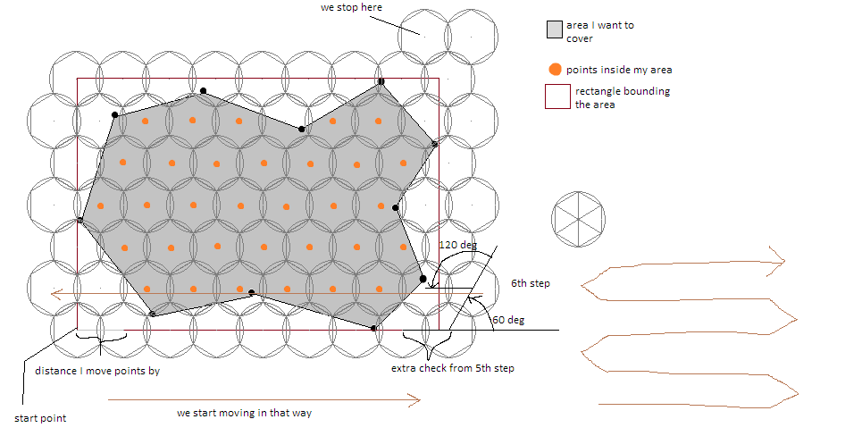
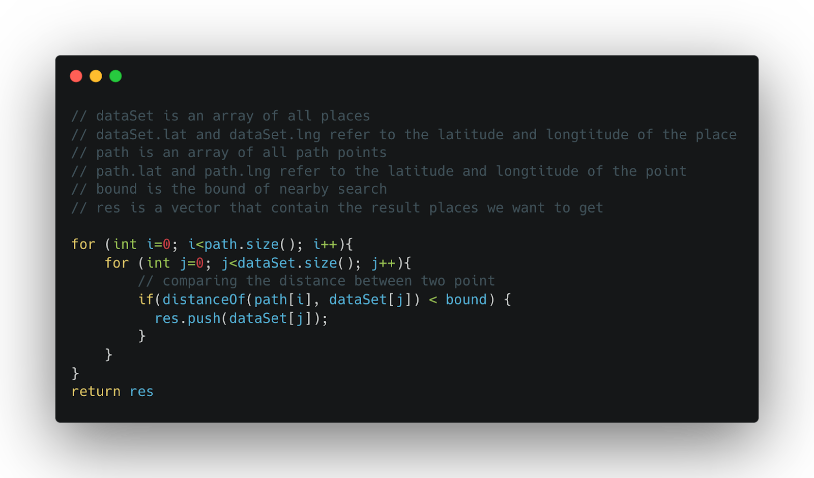
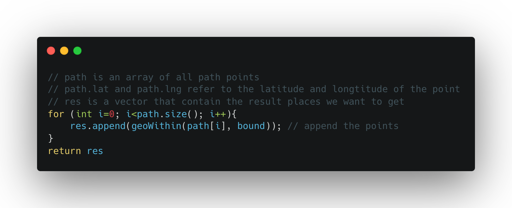
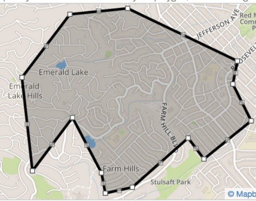
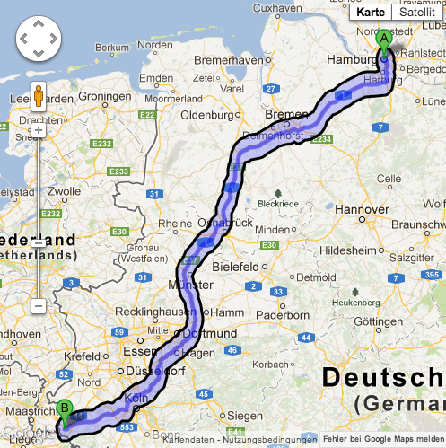

# 指定路線之地點推薦系統

---

# 為何要作此一專題研究？

我們發現在規劃旅遊時，雖然可以透過一些網路上的推薦或是地理資訊服務（如：Google Map）知道目的地附近的餐廳或景點來規劃行程，卻常常忽略了許多可能在路線上值得前往地點的可能性。因而錯過了一些本來順路就會想去，卻沒有注意到地點。我們希望透過此專案，製作一個以路線為基礎的地點取得系統。並透過此機會，嘗試並學習資料庫、地理資訊、前後端相關之軟體套件應用於專案。

---

# 方法與步驟

- 取得地圖資料
- 取得路線
- 取得路線附近的地點
- 排序
  - 透過餐廳評價數量和評價星數
  - 從評論中抓取有效資訊

---

# 取得地圖資料

Place API 的 NearbySearch 是搜尋「特定點與半徑所形成的圓」內的地點，如果搜尋結果超過60個，最多只會回傳60筆資料。徑所形成的圓」內的地點，如果搜尋結果超過60個，最多只會回傳60筆資料。因此，為了讓重複搜尋的面積縮到最小，我們使用以下的搜尋方式:

---

如圖中所示，每次搜尋範圍所形成的圓，以正六邊形相鄰，這樣的搜尋方式可以最小化重複面積。



---

# 取得路線與接近的地點

透過Google 提供的 Direction API 我們可以提供起點與終點，得到一個連續的經緯度座標。於是接下來便是嘗試透過此座標連成的路徑，從資料庫中取出路徑附近的資料。

- Approach 1: 遍歷地點 ＋ 計算距離
- Approach 2: 遍歷 ＋ MongoDB Spatial Query
- Approach 3: Bufer Polyline + MongoDB Polygon Search

---

<!-- ## Approach 1: 遍歷地點 ＋ 計算距離 -->



---

# Approach 2: 遍歷 ＋ MongoDB Spatial Query



---

# Approach 3: Bufer Polyline + MongoDB Polygon Search

- 在空間位置（Spatial Data）的搜尋上，除了以點為中心的搜尋方法外他們也提供了另外一種基於多邊形（Polygon）的搜尋方式。
- 可以透過將路線（Path）轉換為多邊形（Polygon）後，在使用此多邊形對資料庫請求。於是我們的問題變成了「如何將輸入的路線變成多邊行？」（How to buffer a line to polygon）

---






---

# 排序：透過餐廳評價數量和評價星數

對於搜尋到的餐廳，無法一次都顯示在使用者的畫面上。於是排序結果也是一個重要的部分。再取出資料後，希望通過排序讓更有**可能勾起使用者興趣的地點**更容易顯示在使用者的畫面上。

### 觀察：
- 評價好的店家不代表是會吸引人的店家，反而可能因為評論數量的太少，只有少數人給了高分。
- 許多熱門的地點或是評價不錯的店家，雖然沒有高星數，但是會有許多的評論。

---
於是，我們將算法做了權重的調整。因為我們發現，有許多熱門的地點或是評價不錯的店家，雖然沒有高星數，但是會有許多的評論。於是我們將排序依據改成：
## 地點星數 * （地點評價數量）½

---

# 排序：透過使用者輸入增加某些餐廳的權重

- 取得餐廳重要資訊
- Approach 1：從菜單圖片中拿取
- Approach 2：從評論中擷取重要資訊

---

# Approach 1：從菜單圖片中拿取

- 有需要了話再去整理

---

# Approach 2：從評論中擷取重要資訊

- 取得評論
- 斷詞＋萃取資訊
- 對清洗完的評論做 word2vec

---

### Google 提供的評論資訊
一間餐廳最多會有五筆評論。而這五比評論已經透過 Google 自己的演算法整理過，因此資訊量通常都蠻豐富的。
```
弘大歐吧（韓國紫菜飯捲專賣店）
[
  '韓國老闆很可愛～份量很足夠，吃不下外帶的時候老闆開玩笑問為什麼沒吃完～是不是不好吃！？\n' +
    '\n' +
    '飯卷很好吃，這次是吃起司跟辣豬肉的～是會讓人想念的味道；辣炒年糕對我來說不夠辣（配的餅乾沾辣醬好好吃），但我覺得應該符合多數台灣人口味，有去政大一定會再吃的！',
  '歐巴拌麵的醬是自己可以決定要不要加跟加多少的，但那個醬真的太辣了😂😂😂\n' +
    'Mini紫菜捲份量不大，沒有很餓的話點他剛剛好👍🏻店員們都很親切💕',
  '汽機車都不好停 最好停好再來\n' +
    '用餐時間內用外帶的都多 盡量避開\n' +
    '餐點以主餐為主 沒有小菜湯品等等\n' +
    '\n' +
    '醬豬肉拌飯：120\n' +
    '豬肉不算多 所以配料辦一辦 吃醬\n' +
    '\n' +
    '芝士辛拉麵：120\n' +
    '朋友吃說還ok\n' +
    '\n' +
    '辣炒年糕（小）90\n' +
    '除了年糕之外還有不知道名稱\n' +
    '類似甜不辣跟豆皮\n' +
    '年糕比較紮實 還附上一片芝士\n' +
    '\n' +
    '#針對讓學生吃飽的店家',
  '飯捲好吃！辣醬豬肉飯捲味道很棒\n' +
    '屬於微辣的辣度 如果平常敢吃一點辣的人應該沒什麼問題\n' +
    '份量對於女生來說剛好\n' +
    '男生可能會吃不飽 需要搭配其他餐點\n' +
    '是會想回訪的店',
  '飯捲份量是會吃不完的\n內用拌飯很棒 辣醬可以自己加\n辣炒年糕調味是好的 就是有點貴然後份量小\n點過大的小的都是>'
]
```

---

## 斷詞＋萃取資訊：取得向量

- 餐廳資料：
  - 利用評論，並使用 jieba 斷詞並透過 spacy 轉成 300 維的向量
- 使用者輸入：
  - 將輸入的資訊做斷詞，並計算與餐廳資料的相似度

---

## 斷詞＋萃取資訊：排序

- 優先將相似度高的餐廳排序（相似度高的餐廳，可能是使用者想要的餐廳）
- 如果相似度接近（相似度相差 < 0.05），則優先使用 Approach 1 的排序

---

# Demo

---

## 狀況一：騎車去家樂福買東西，要順便吃晚餐。
  * 設定起點終點
  * 輸入重要資訊：騎車 便當 鴨肉飯 壽司 晚餐
  * 特點：
      * 日常
      * 短距離
      * 飲食偏好
      * 不一定要到終點才吃（路途會經過許多不錯的店家）

---

## 狀況二：從政大去基隆看海，中途不知道吃什麼，海邊也沒東西吃。（政大->碧砂魚港）
  * 設定起點終點
  * 設定分大段、搜尋距離大
  * 輸入重要資訊：開車 生魚片 麵 便宜 晚餐 宵夜
  * 特點：
      * 出去玩
      * 長距離
      * 飲食偏好
      * 終點附近可能什麼都沒有（要在到海邊之前就找到地方吃東西）

---

## 狀況三：從政大去淡水，中途會經過市區。（政大->蘆洲紅燒羊肉拉麵-淡水總店）

  * 設定起點終點
  * 設定分大段、搜尋距離大
  * 輸入重要資訊：開車 小吃 晚餐
  * 特點：
      * 出去玩
      * 長距離
      * 飲食偏好
      * 中途會經過市區

---

## 狀況四：在澎湖玩，早上從旅館要去二坎，想知道在整條路途上可以吃東西的地方。
  * 設定起點終點
  * 設定不分段、搜尋距離小
  * 輸入重要資訊：騎車 便宜 早餐
  * 特點：
      * 出去玩
      * 中距離
      * 很少地點（不可能跑到市區再跑去二坎，不然二坎人好多）

---

